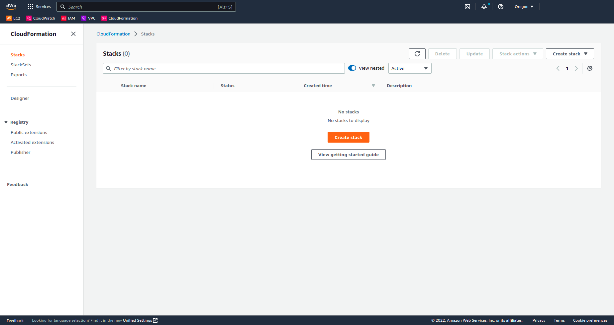

# LABORATORY-AWS-CLOUDFORMATION

This laboratory is a project created for testing and learning how to use all the functionnalities of cloudformation. I obviously have not seen everything but I have seen what I judge the most important such as how to use the documentation for creating resources using a stack, how to use the properties for configurating the resources as I want and so on...

I started using the my cloudformation template as JSON but discover after using it that YAML is actually better since I can the comment in my template for explaning part or commenting part that I dont wanna use.

## How to use a template

## Experiences

- **Experience1**: Create a S3 with a name from parameters
- **Experience2**: Create a network with a private and public subnet
- **Experience3**: Create a ASG
- **Experience4**: Creating a userdata for updaing the server and installing nvm&pm2 
- **Experience5**: Creating an parameter => output => export
- **Experience6**: Using ImportValue for getting name from experience5

#### Experience6

Experience6 is a bit more tricky compare to the other one so let me explain a little. I have created a stack using the experience5 and use the `Fn::ImportValue` to import the name into my experience6 template.

As you can see uunder, the export name is exactly the same as what is inside the template experience6.

